# svp

`svp` is a CLI agent harness built around a persisted Markdown workspace, a TDD-first execution policy, and resumable local runs. It is designed to expose the `svp` binary, detect whether the current repository already has an active project loop, and either create or continue that loop.

## What It Does

The CLI now has two layers:

- `svp` launches the default wizard and inspects the current repository.
- `svp plan`, `svp run`, and `svp status` remain expert commands.
- `svp index` and `svp query` expose the MarkdownDB-backed document index.

Supported agent backends are:

- `codex`
- `claude-code`
- `gemini`
- `opencode`

## Core Model

The loop stores one active project per repository inside `.task-loop/`:

```text
.task-loop/
  project.md
  state.json
  events.jsonl
  tasks/
    T-001.md
    T-002.md
  runs/
    <run-id>.json
```

File roles:

- `project.md`: central human-readable project reference with YAML frontmatter.
- `tasks/T-xxx.md`: one executable Markdown file per sub-task.
- `state.json`: runtime state for attempts, active agent, fallback, timeout, and pause/failure reasons.
- `events.jsonl`: append-only event log.
- `runs/*.json`: persisted run snapshots.

The YAML frontmatter is intentionally structured so the workspace can later be indexed cleanly by tools such as MarkdownDB.

## Packaging

The package is prepared for direct publication as `svp`.

Expected usage after publication:

```bash
npx svp
bunx svp
```

The installed binary remains `svp`.

## TDD-First Policy

The loop is opinionated: implementation should start from tests or an explicit local validation strategy.

By default, planning creates a 4-step slice for each requested change:

- define test scenarios
- write failing tests
- implement minimal code
- refactor and harden

If a task cannot be meaningfully covered by automated tests, it still needs all of the following in its task file:

- a `Test Exception Justification`
- a `Risk Reduction Strategy`
- a `Validation Plan`

That rule applies to `docs` and `infra` work too. The loop never treats “not testable” as “not validated”.

## Wizard Flow

Running `svp` with no sub-command inspects the repository and suggests a mode:

- `Create project` if no active workspace exists
- `Continue project` if a workspace exists with open tasks
- `Revise plan`
- `Add task`
- `Show status`

The wizard shows the detected project title plus open and paused task counts when a project is present.

## Expert Commands

### `svp plan`

Creates a new project, revises the active project, or adds a new TDD slice.

Important behavior:

- one active project per repository
- no backward compatibility with the old `plan.json` / `PRD.md` format
- interactive mode collects context, goal, constraints, test charter, quality gates, and agent choices
- non-interactive mode derives a project from the raw description

Examples:

```bash
svp plan --task "Ship the new harness" --agents codex,opencode --no-interactive
svp plan --task "Add another feature slice" --mode add-task --agents codex,opencode --no-interactive
svp plan --task "Tighten the overall scope" --mode revise-plan --agents codex,opencode --no-interactive
```

### `svp run`

Runs the active project loop.

Current runtime behavior:

- dependency-aware execution
- resumable state via `state.json`
- one active task at a time for deterministic first-pass orchestration
- timeout per task
- automatic agent fallback for provider-like failures
- pause when no fallback remains

Fallback is attempted for reasons such as:

- `quota_exceeded`
- `rate_limited`
- `cost_limit_reached`
- `binary_missing`
- `timeout`

Fallback is not automatic for general implementation or validation failures.

### `svp status`

Shows the current project summary, open tasks, paused tasks, active agent per task, and the next ready task. If no project exists yet, it returns a friendly message instead of crashing.

### `svp index`

Indexes `.task-loop/project.md` and `.task-loop/tasks/*.md` into `.task-loop/markdown.db` using MarkdownDB.

This also runs automatically after `svp plan` and `svp run`, so the explicit command is mainly useful for diagnostics.

### `svp query`

Queries the MarkdownDB index with frontmatter-based filters.

Examples:

```bash
svp query --kind task
svp query --kind task --status paused
svp query --kind task --type tests
svp query --kind task --test-required
svp query --json
```

## Example Artifacts

`project.md` contains:

- project frontmatter
- context
- goal
- constraints
- testing policy
- test charter
- quality gates
- minimal task index
- completion criteria
- progress log

Each `tasks/T-xxx.md` contains:

- task frontmatter
- goal
- scope
- acceptance criteria
- test plan
- implementation notes
- optional test exception sections
- progress log

## Prerequisites

- Node.js 22
- npm
- the agent CLIs you want to use available on `PATH`

## Local Usage

Install dependencies:

```bash
npm install
```

Use the wizard:

```bash
npm run dev
```

Run the published package once available:

```bash
npx svp
bunx svp
```

Use expert commands directly:

```bash
npm run dev -- plan --task "Ship the new harness" --agents codex,opencode --no-interactive
npm run dev -- run
npm run dev -- status
```

Build the distributable CLI:

```bash
npm run build
node dist/cli.js plan --task "Improve the README" --agents codex,opencode --no-interactive
```

## Testing The Loop

Run the full automated suite:

```bash
npm test
```

Run only the CLI smoke test layer:

```bash
npm run test:smoke
```

The smoke tests do not require real agent CLIs. They create temporary stub binaries named `codex`, `claude`, `gemini`, and `opencode`, then exercise the real CLI through:

- project creation
- task execution
- status reporting
- MarkdownDB indexing and querying
- fallback agent reassignment
- add-task mode
- revise-plan mode

## Current Limitations

- the runtime is intentionally sequential for now, even though the document model supports future sub-agent fan-out
- provider cost tracking is modeled in state but not yet backed by a real provider billing integration
- the MarkdownDB integration currently indexes the active `.task-loop` workspace only; it is not yet used to drive planning or orchestration decisions
- the package is prepared for direct publication and execution as `svp`

## Workflow Diagram



The source for the diagram lives in `WORKFLOW.mmd`. Regenerate the committed SVG locally with:

```bash
npm run render:workflow
```

CI targets Node 22. The separate render workflow keeps `docs/workflow.svg` in sync with `WORKFLOW.mmd` and commits the SVG back to the branch when it changes.
